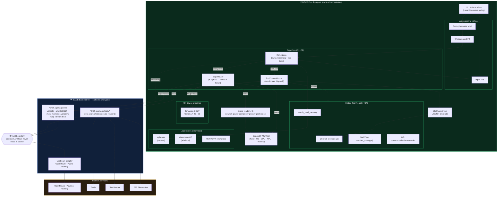
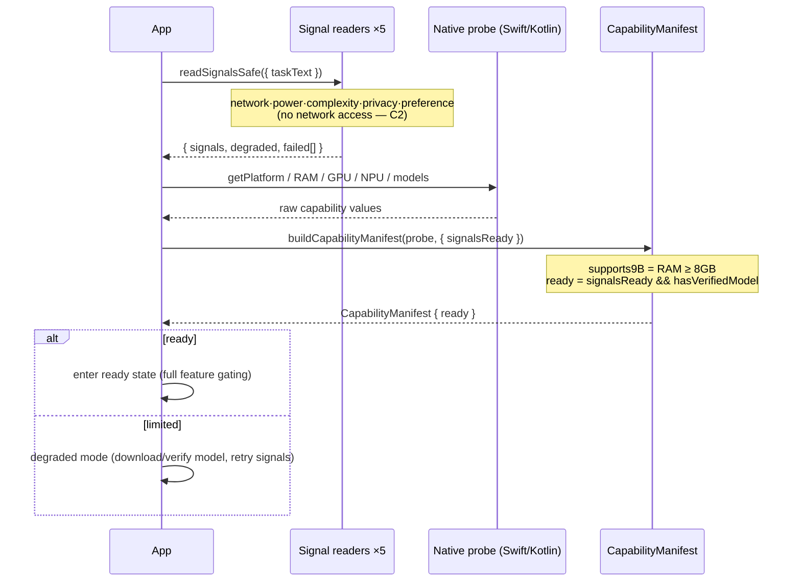
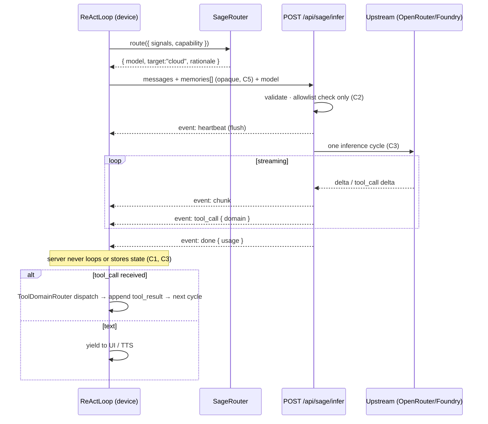
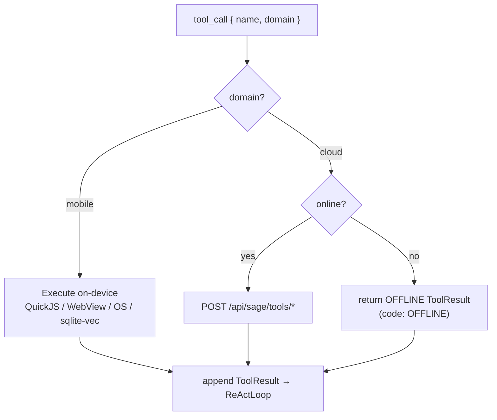
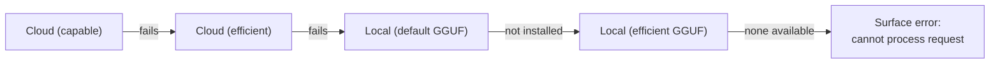

# SAGE-AGENT — System Architecture (Phase 1)

> The device is the agent. The backend extends its reach.

This document is the Phase 1 architecture deliverable. It shows every component,
the trust boundary between device and server, and the control flow for both
local and cloud inference cycles. The constitutional constraints are annotated
inline as **[C1]–[C6]**.

## Constitutional constraints (binding)

| # | Constraint |
|---|------------|
| C1 | The device owns the ReAct loop. The server runs exactly one inference cycle per request. |
| C2 | The SageRouter is fully on-device. The server applies an allowlist check only — never a routing override. |
| C3 | `POST /api/sage/infer` is a stateless proxy: validate, forward, stream, return. No loop, no cross-call state. |
| C4 | The two-domain tool registry is authoritative. Mobile tools never run on the server; cloud tools fail when offline. |
| C5 | Memory is on-device and never synced. The backend treats `memories[]` as opaque prompt text. |
| C6 | No new features on deprecated paths (`/api/sage/agent`, `calculateRoute()`, the VM sandbox, native mocks). |

## 1. System component diagram



## 2. Cold-start capability boot (Phase 0)

The app may only enter `ready` state once the Capability Manifest is assembled
**and** all five signals are readable.



## 3. ReActLoop — cloud-target cycle (SSE contract)



## 4. ReActLoop — local-target cycle (offline)

```mermaid
sequenceDiagram
  participant RL as ReActLoop (device)
  participant AR as SageRouter
  participant LL as llama.cpp (GGUF)
  participant TDR as ToolDomainRouter

  RL->>AR: route({ signals, capability })
  Note over AR: offline / critical battery / sensitive / prefer_local<br/>→ hard local override
  AR-->>RL: { model:"gemma-4-2b", target:"local" }
  RL->>LL: generate(messages)
  loop tokens
    LL-->>RL: token stream
  end
  alt tool_call
    RL->>TDR: dispatch(tool_call)
    alt mobile tool
      TDR-->>RL: tool_result (on-device)
    else cloud tool while offline
      TDR-->>RL: { error:"OFFLINE", code:"OFFLINE" }
      Note over RL: model adapts; never blocks
    end
  end
```

## 5. ToolDomainRouter dispatch



## 6. Graceful degradation hierarchy



## 7. Two-domain tool registry (C4)

| Tool | Domain | Offline behavior | Runtime |
|------|--------|------------------|---------|
| `execute_js` | mobile | native | QuickJS isolated context |
| `render_prototype` | mobile | native | sandboxed WebView |
| `read_native_contacts` | mobile | native | Contacts (EventKit / ContactsContract) |
| `create_calendar_event` | mobile | native | EventKit / CalendarContract |
| `set_reminder` | mobile | native | EventKit / AlarmManager |
| `query_calendar` | mobile | native | EventKit / CalendarContract (P6) |
| `list_reminders` | mobile | native | EventKit / local store (P6) |
| `file_system` | mobile | native | Files.app / SAF, sandboxed (P6) |
| `search_local_memory` | mobile | native | sqlite-vec top-k |
| `web_search` | cloud | OFFLINE error | Tavily |
| `fetch_webpage` | cloud | OFFLINE error | Jina Reader |
| `execute_python` | cloud | OFFLINE error | E2B Firecracker |
| `deep_research` | cloud | OFFLINE error | Tavily + Jina (server-orchestrated) |

13 tools after Phase 6 (9 mobile / 4 cloud); integrity enforces domain + offline
consistency, not a frozen count.

## 8. Repository ↔ architecture map

| Component | Where it lives | Phase |
|-----------|----------------|-------|
| Domain vocabulary | `packages/shared-types` | 0–1 ✅ |
| SSE contract (parser + serializer) | `packages/sse-contract` | 0–1 ✅ |
| Two-domain registry | `packages/tool-registry` | 0–1 ✅ (dispatcher: P3) |
| Signal readers + Capability Manifest | `packages/core` | 0 ✅ |
| SageRouter / ReActLoop / ToolDomainRouter | `packages/core` (`router.ts`, `agent/*`) | 3 ✅ |
| Cloud/local inference targets + 50-case routing benchmark | `packages/core/src/agent`, `src/benchmark` | 3 ✅ |
| SAGE Backend v3 proxy | `apps/backend` | 0–1 ✅ |
| Native capability + thermal probe | `apps/mobile/modules/sage-capability` | 0 ✅ |
| Native signal providers + boot screen | `apps/mobile/src`, `App.tsx` | 0 ✅ |
| Voice pipeline (Porcupine/Whisper/Piper) | `apps/mobile` | P2 |
| QuickJS / E2B sandbox | `packages/sandbox-core`, `apps/mobile`, `apps/backend` | 4 ✅ |
| sqlite-vec RAG + memory lifecycle + injection | `packages/memory-core`, `apps/mobile/src/memory` | 5 ✅ |
| Online research (Tavily + Jina synthesis) | `apps/backend/src/research.ts` | 5 ✅ |
| Deep OS integrations (Contacts/Calendar/Reminders/Files) | `apps/mobile/modules/sage-os`, `apps/mobile/src/os` | 6 ✅ |
