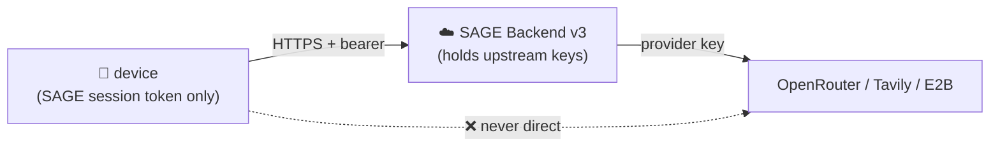

# SAGE-AGENT — Security & App Store Compliance Strategy (Phase 1)

This is the Phase 1 compliance deliverable. It states how SAGE-AGENT satisfies
Apple App Store Guideline 2.5.2, encrypts all local data, isolates secrets, and
keeps memory private — and where each control is enforced in the codebase.

## 1. Apple App Store Guideline 2.5.2 — sandboxed code execution

> 2.5.2: apps may not download, install, or execute code which introduces or
> changes features or functionality of the app.

SAGE-AGENT executes two kinds of generated code. Both are strictly sandboxed and
**cannot alter core app functionality**:

| Path | Sandbox | Isolation guarantee |
|------|---------|---------------------|
| `execute_js` | **QuickJS** isolated context | A fresh QuickJS runtime/context per execution. No bridge to native modules, the React tree, file system, or network. Inputs/outputs are plain serializable values. The context is torn down after each run. |
| `render_prototype` | **WebView** sandbox | HTML/JS/CSS rendered in a `WKWebView`/Android `WebView` with JavaScript bridges disabled, `file://` and app-origin access denied, and no `postMessage` channel to native. It is a visual preview surface only. |

Key compliance points:

- **Generated code is data, not app code.** Skills (Phase 3 Skill Acquisition)
  are stored as JSON definitions + JS executed *only* inside QuickJS. They never
  become part of the app bundle, never patch native modules, and never change
  app features — they are sandboxed computations the user invokes.
- **No remote code drives the app.** The cloud path returns *text and tool-call
  intents* over the SSE contract. The device decides what to do; downloaded
  bytes are never `eval`'d as app logic.
- **The deprecated `vm` sandbox is forbidden (C6).** Node's `vm` is not a
  security boundary; server-side execution uses E2B Firecracker microVMs, and
  on-device execution uses QuickJS. No new code targets `vm`.

Enforcement in repo: `execute_js` / `render_prototype` are registered `mobile`
tools in `packages/tool-registry`; the SandboxManager (Phase 4) instantiates the
isolated QuickJS context and the locked-down WebView.

## 2. Encryption at rest — SQLCipher + encrypted MMKV

All locally persisted user data is encrypted at rest:

| Store | Contents | Encryption |
|-------|----------|------------|
| WatermelonDB | relational state (conversations, agents, skills) | **SQLCipher** (AES-256) |
| sqlite-vec | memory vectors + text | same **SQLCipher** database/keying |
| MMKV | settings, KV cache, routing prefs | MMKV `encryptionKey` (AES) |

- The SQLCipher key and the MMKV `encryptionKey` are **generated with a CSPRNG
  on first launch** and stored only in hardware-backed secure storage (below).
- Deletion is real: removing a memory deletes the row and triggers a vector
  compaction; no shadow copy is retained (matches the in-app Memory promise).

Enforcement in repo: `apps/mobile/src/storage/secureSettings.ts` centralizes the
MMKV instance behind a single key accessor (`provisionedKey()`), marked
`TODO(phase-1)` to read from Keychain/Keystore so no call site ever sees a raw
key.

## 3. Secret isolation — Keychain / Keystore

| Secret | Storage | Notes |
|--------|---------|-------|
| SQLCipher / MMKV encryption keys | iOS **Keychain** (`kSecAttrAccessibleAfterFirstUnlockThisDeviceOnly`) / Android **Keystore** (StrongBox where available) | Never written to JS-readable storage; never logged. |
| SAGE session token (device ↔ backend) | Keychain / Keystore | Used as the `Authorization` bearer to the SAGE backend only — **not** an upstream provider key. |
| Upstream provider keys (OpenRouter, Tavily, E2B, Azure) | **Server only** | See §4. |

## 4. No upstream API keys ever reach the device

This is the structural guarantee behind "Absolute Data Sovereignty":

- The mobile client **never** contacts OpenRouter / Tavily / Jina / E2B directly.
- All cloud inference flows through `POST /api/sage/infer`; all cloud tools
  through `POST /api/sage/tools/*`. The **backend holds every upstream
  credential** (`apps/backend/.env`, git-ignored; see `.env.example`).
- The server's only model authority is an **allowlist check (C2)** — it accepts
  the model the on-device SageRouter selected and never overrides it
  (`apps/backend/src/allowlist.ts`).



## 5. Memory privacy (C5) + privacy audit

- The sqlite-vec store is **local-only and never synced**. Retrieval, ranking
  and embedding all happen on-device.
- Memory is injected into `infer` requests as `memories[]` and the backend
  treats it as **opaque prompt text** — it does not store, search, rank, or
  embed it (`apps/backend/src/routes/infer.ts → injectMemories`).
- **Server logs counts only**, never memory text or message content:
  `[infer] model=… messages=… memories=<count>`. This is the line a privacy
  audit (Phase 5 success criterion) checks.

## 6. Platform differentiation (verified independently)

| Concern | iOS | Android |
|---------|-----|---------|
| GPU acceleration | Metal | Vulkan |
| Hardware ML | Core ML / ANE | NNAPI |
| OS automation | App Intents | Shortcuts/Intents |
| Secure storage | Keychain | Keystore |
| Thermal source | `ProcessInfo.thermalState` | `PowerManager.currentThermalStatus` (API 29+) |

Enforcement in repo: `apps/mobile/modules/sage-capability/{ios,android}` implement
these per-platform; the JS layer consumes a single `NativeCapabilityProbe`.

## 7. Thermal & battery guard → SageRouter Signal 2

Sustained inference is monitored. A `critical` thermal reading is folded into the
Power State signal (`readPower()` returns `critical`), which the SageRouter
treats as a **hard local override** (or routes to the efficient local model).
This is wiring, not a separate component — exactly as specified.

Enforcement in repo: `apps/mobile/src/signals/powerProvider.ts` consults
`getThermalState()` before the battery API.

## 8. Permission model

OS tools request permission at first use. Denial returns a clean ToolResult the
ReActLoop handles gracefully:

```json
{ "error": "permission_denied", "code": "PERMISSION_DENIED" }
```

`PERMISSION_DENIED` is non-retryable (`packages/shared-types/src/errors.ts`), so
the loop surfaces it rather than spinning. Usage-description strings for every
sensitive capability are declared in `apps/mobile/app.json`.

## 9. Compliance checklist (Phase 1 gate)

- [x] 2.5.2: QuickJS isolated context + locked-down WebView; generated code can't alter app features.
- [x] Deprecated `vm` sandbox excluded (C6); E2B Firecracker for server execution.
- [x] SQLCipher covers WatermelonDB + sqlite-vec; MMKV encrypted at rest.
- [x] Encryption keys + session token in Keychain/Keystore; never logged.
- [x] No upstream API key path to the device; allowlist-only server authority (C2).
- [x] `memories[]` opaque on the server; logs carry counts only (C5).
- [x] Platform paths (Metal/Vulkan, Core ML/NNAPI, Keychain/Keystore) separated and independently testable.
